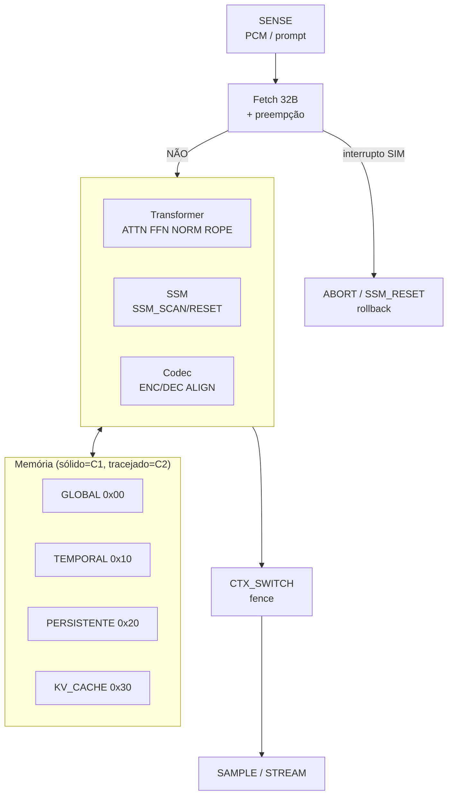
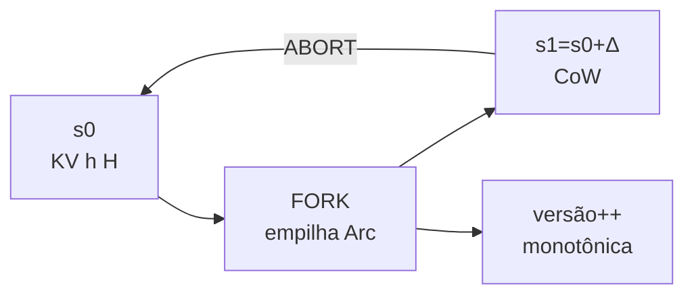
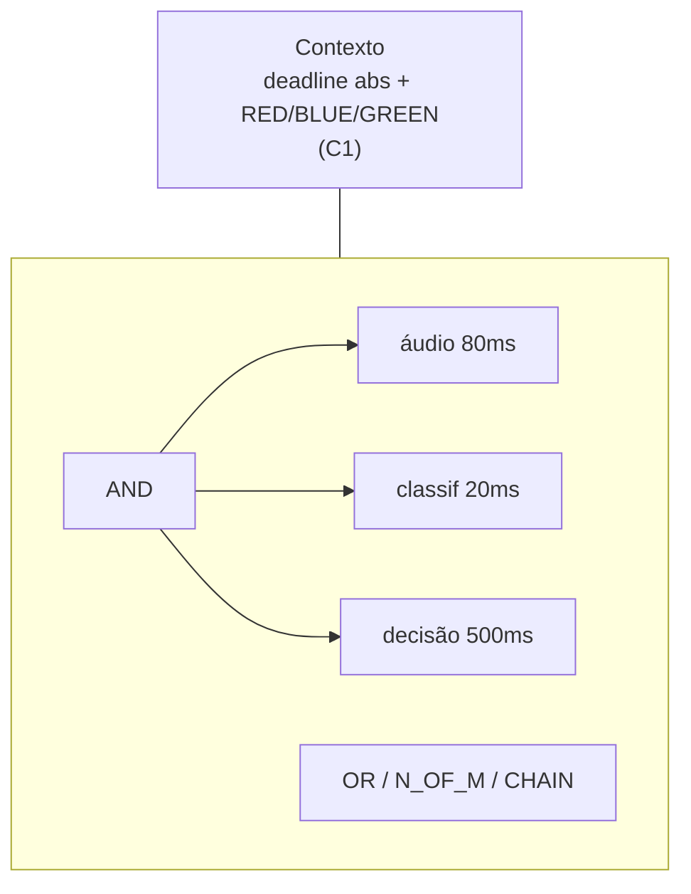
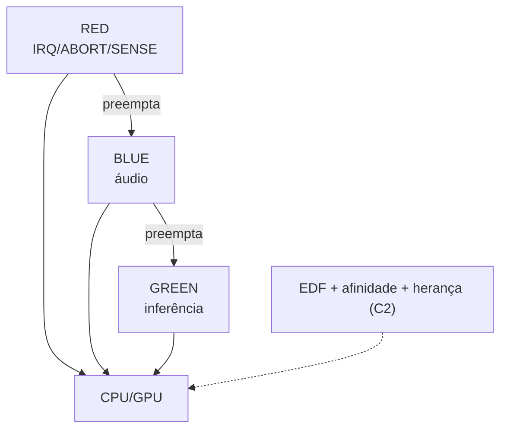
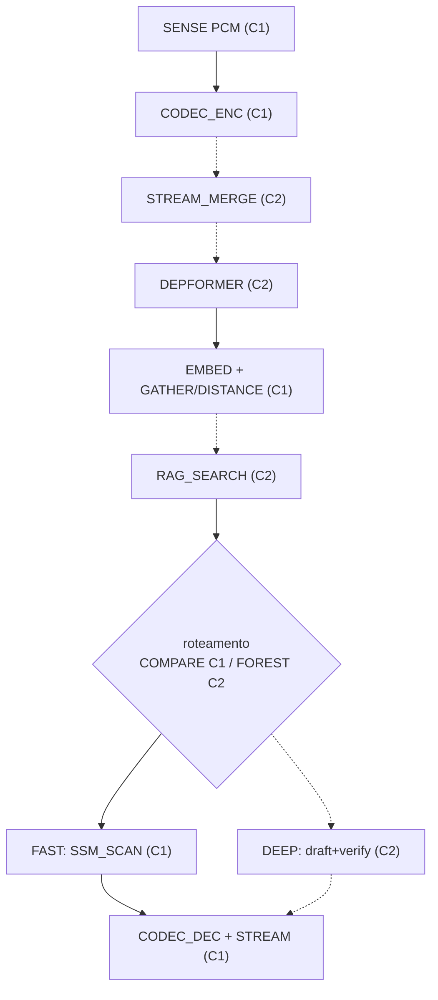

# DESENHOS — briefing para desenhista técnico (Fig. 1–5)

> Regras INPI: traço preto uniforme, sem cores/shading, margens, numeração
> `Fig. N`, setas fechadas, siglas definidas no relatório. Elementos **C2**
> (futuros) em **linha tracejada + etiqueta `(C2)`** — o desenhista mantém o
> tracejado. Diagramas Mermaid abaixo são rascunho; redesenhar em ferramenta
> vetorial (SVG/PDF), uma figura por folha, ~160 dpi mínimo.

## Fig. 1 — Arquitetura geral da VM (blocos + regiões + motores)

**O que mostrar:** à esquerda entradas (PCM 24 kHz / prompt texto) via `SENSE`;
ao centro `Fetch 32B → checagem de preempção → dispatch`; três motores sobre o
mesmo bloco de memória (Transformer O(N), SSM O(1), Codec); `CTX_SWITCH` como
fence entre motores; à direita `SAMPLE/STREAM`. Abaixo, bloco de memória com 4
caixas sólidas (GLOBAL/TEMPORAL/PERSISTENTE/KV_CACHE) + 12 caixas tracejadas
(C2: TEXT/WEIGHTS/ACTIVATION/ARENA/SHARED/WAL/SNAPSHOT/STREAM_RING/RAG_INDEX/
CLUSTER_STAGING/SCRATCH_GPU/MMIO). Barramentos `watch/broadcast` como setas
finas laterais (nota: Tokio, não silício).

**Legenda sugerida:** 10 = fetch; 12 = motores; 14 = fence; 16–19 = regiões C1.

## Fig. 2 — Rollback conjunto (FORK → mutação → ABORT)

**O que mostrar:** linha do tempo horizontal com 3 colunas de estado (KV
Transformer, h_t SSM, H RANK1). `FORK` empilha referências (setas finas, sem
cópia); mutação cria blocos novos CoW (hachura leve); `ABORT` troca ponteiros
de volta (seta grossa). Caixa lateral: `versão monotônica (I-Mono IMPL)` com
seta sempre crescente; `I-Persist (guarda futura C2)` como losango tracejado.
Teste T1 em nota (100/50/50 bit-exato).

## Fig. 3 — Deadlines (C1 sólido + C2 tracejado)

**O que mostrar:** à esquerda, contexto com `deadline absoluto + prio`
(C1, sólido). À direita, árvore C2 tracejada: raiz `AND` com filhos
`áudio 80 ms / classif. 20 ms / decisão 500 ms`; abaixo variantes `OR`,
`N_OF_M (2/3)`, `CHAIN (ordem temporal)` como 3 sub-caixas. Seta de violação
subindo com losango `propaga?`.

## Fig. 4 — Scheduler (filas C1 + EDF/afinidade C2)

**O que mostrar:** três filas verticais `RED / BLUE / GREEN` (C1) com setas de
preempção para baixo; ao lado, bloco tracejado `EDF + afinidade disp/NUMA +
herança cross-device (corte ≤16)` alimentando as mesmas filas. `BARRIER com
timeout→NACK` como losango tracejado. Nota: sem NVLink medido.

## Fig. 5 — Pipeline multi-modelo (exemplo voz→RAG→decisão→voz)

**O que mostrar:** fluxo vertical com caixas sólidas = opcodes IMPL e
tracejadas = RSVD. Incluir tabela lateral de deadlines-alvo (marcar `alvo`).
Ramos FAST (Mamba) / DEEP (draft+verify) como losango `FOREST (C2)` ou
`COMPARE (C1)` — mostrar ambos: roteamento C1 hoje por `COMPARE`, `FOREST`
futuro.

**Checklist do desenhista:** 5 folhas; mesma espessura de linha; nada de
logotipo; referências numéricas entre parênteses coerentes com relatório
§5; entregar SVG + PDF.

---
*Author: Matheus de Camargo Marques — matheuscamarques@gmail.com — ORCID [0009-0003-4518-2258](https://orcid.org/0009-0003-4518-2258).*
